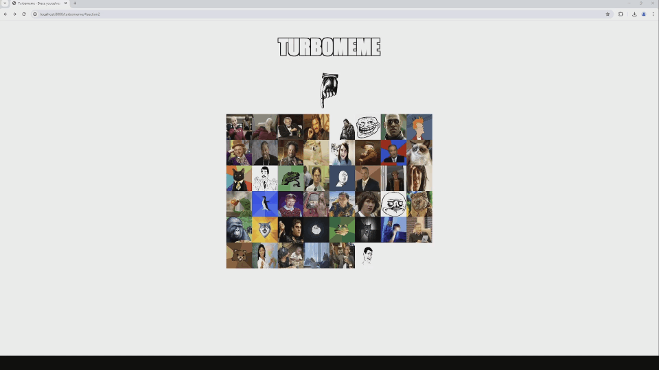

# Turbomeme



Apply different kinds of filters to meme images and publish them!  

## Tech stack

- Java 17
- ActiveJDBC
- Maven
- Tomcat
- PostgreSQL
- Docker

## Building and running on Windows using IntelliJ

- Install Java JDK 17, IntelliJ Community Edition, and Docker Desktop
- Clone this repository with Git
- Then import the cloned repository as a project in IntelliJ
- Set the project SDK to JDK 17 and the language level also to 17
- Import project using IntelliJ's Maven integration
- Build project using Maven's "package" command
- At this point set up the required environment variables. Add a file called .env and env.bat to the root of the project. These files will be ignored by Git as they contain credential information.

.env file:

``` 
TURBOMEME_APP_NAME=turbomeme
TURBOMEME_DB_HOST=host.docker.internal
TURBOMEME_DB_PORT=5432
TURBOMEME_DB_NAME=<db_name>
TURBOMEME_DB_USERNAME=<db_username>
TURBOMEME_DB_PASSWORD=<db_password>

POSTGRES_USER=<db_username>
POSTGRES_PASSWORD=<db_password>
POSTGRES_DB=<db_name>
```
 
env.bat file:

```
@echo off

set TURBOMEME_APP_NAME=turbomeme
set TURBOMEME_DB_HOST=host.docker.internal
set TURBOMEME_DB_PORT=5432
set TURBOMEME_DB_NAME=<db_name>
set TURBOMEME_DB_USERNAME=<db_username>
set TURBOMEME_DB_PASSWORD=<db_password>

set POSTGRES_USER=<db_username>
set POSTGRES_PASSWORD=<db_password>
set POSTGRES_DB=<db_name>
```
 
- Before continuing, make sure Docker Desktop is running. Start a Command Prompt. Go to the project directory and run the following commands:

```
# env.bat
# docker-compose up
```

- After the service has finished booting up, open up a browser and go to http://localhost:8080/turbomeme
- Enjoy!
